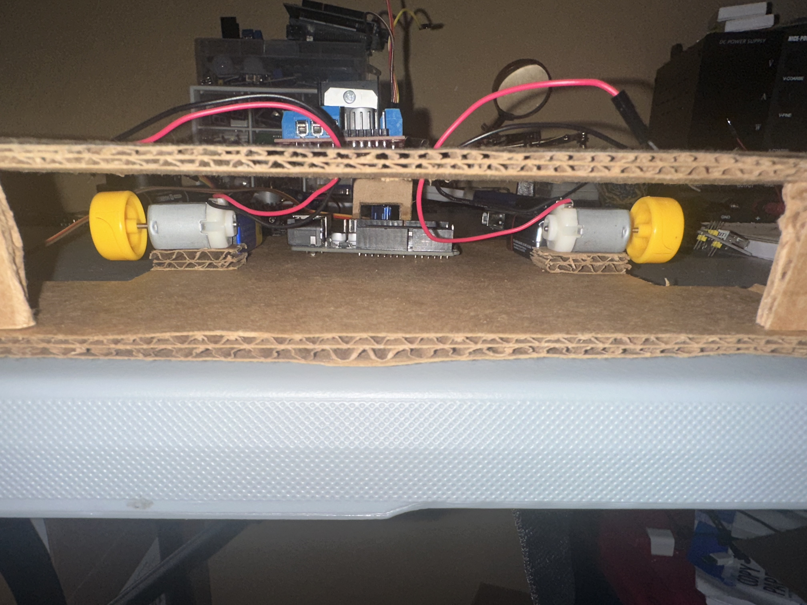

# 3d-printed-rover
An automated thermal data logging rig built using an Arduino Uno

# Robotics Chassis Project

To evaluate weight distribution, wheel clearance, and component mounting before CAD modeling, a low-fidelity cardboard chassis prototype was built.

### Prototype Gallery
|  |  |  |  |
